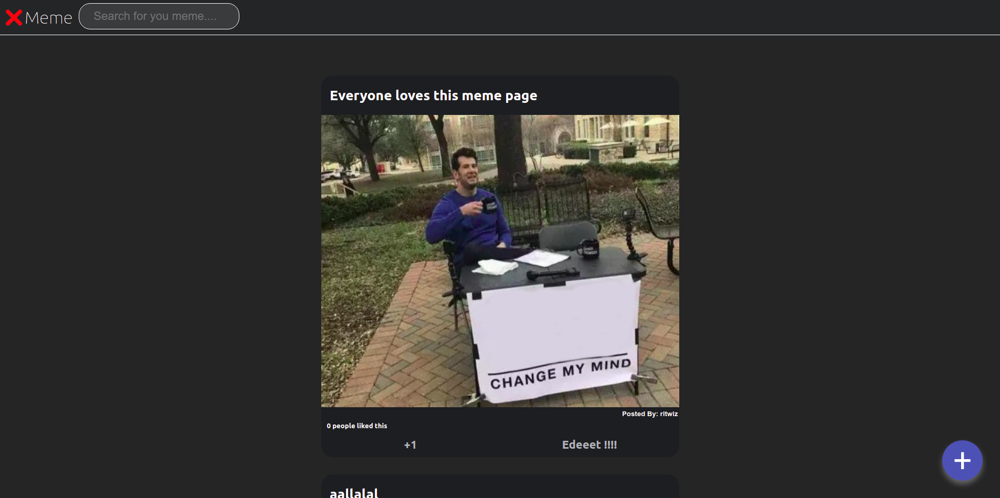

## X-MEME
A platform for users to match the hilarious images to their even more hilarious captions.
The [app](https://xmemeclient.herokuapp.com/) can be found here.
The [server](https://xmeme-api-server.herokuapp.com/swagger-ui/) swagger endpoint can be found here.
<div>

</div>

### Features
- Posting memes with custom captions, names and urls
- Urls and meme image recommendations
- Editing the memes image and captions
- Liking a meme post
- Viewing the total likes on meme post
- Responsive UI
- Searching for your favourite meme captions
- Supports https
- Supports Swagger
- Dockerised application


### Installation

#### Local

For local development and testing 

- clone the repo
```
git clone https://gitlab.crio.do/COHORT_ME_BUILDOUT_XMEME_ENROLL_1612436694845/ritwizsinha0-me_buildout_xmeme.git

```
- Start the server
    For running locally the server requires either mongo installed on the host or provide the mongo atlas connection details and replace it with MONGO_URI specified in the ./server/config.js.
    If mongo is running locally make sure it is running on port 27017 or specify the port in the ./server/config.js file
    After connecting mongo run these commands.
```
cd server
npm install
npm start

```
- Start the client

```
cd ../client
npm install
npm start
```

#### Docker
For creating an image of the server run
```
docker build -t [image_name] .
```

For running the server image container run
```
docker-compose up
```

For stopping the server image container run
```
docker-compose down
```

### Swagger
Once the server is running go to localhost:8080/swagger-ui to see the list of api endpoints

### Tech Stack
The client side is built with:
- React
- Html
- Css

The server side is built with
- Node
- Express
- Mongoose
